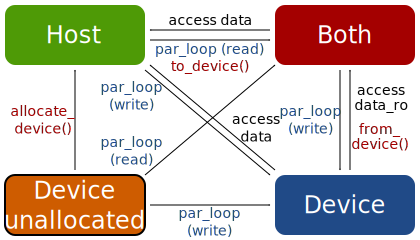

.. _backends:

PyOP2 Backends
==============

PyOP2 provides a number of different backends to be able to run parallel
computations on different hardware architectures. The currently supported
backends are

* ``sequential``: runs sequentially on a single CPU core.
* ``openmp``: runs multiple threads on an SMP CPU using OpenMP. The number of
  threads is set with the environment variable ``OMP_NUM_THREADS``.
* ``cuda``: offloads computation to a NVIDA GPU (requires :ref:`CUDA and pycuda
  <cuda-installation>`)
* ``opencl``: offloads computation to an OpenCL device, either a multi-core
  CPU or a GPU (requires :ref:`OpenCL and pyopencl <opencl-installation>`)

Distributed parallel computations using MPI are supported by PyOP2 and
described in detail in :doc:`mpi`. Datastructures must be partitioned among
MPI processes with overlapping regions, so called halos.  The host backends
``sequential`` and ``openmp`` have full MPI support, the device backends
``cuda`` and ``opencl`` only support parallel loops on :class:`Dats
<pyop2.Dat>`. Hybrid parallel computations with OpenMP are possible, where
``OMP_NUM_THREADS`` threads are launched per MPI rank.

.. _host_backends:

Host backends
-------------

Any computation in PyOP2 requires the generation of code at runtime specific
to each individual :func:`~pyop2.par_loop`. The host backends generate code
which is just-in-time (JIT) compiled into a shared library callable
via :mod:`ctypes`.  The compilation procedure also takes care of
caching the compiled library on disk, such that the compilation cost
is not paid every time.

.. _sequential_backend:

Sequential backend
~~~~~~~~~~~~~~~~~~

Since there is no parallel computation for the sequential backend, the
generated code is a C wrapper function with a ``for`` loop calling the kernel
for the respective :func:`~pyop2.par_loop`.  This wrapper also takes care of
staging in and out the data as requested by the access descriptors requested
in the parallel loop.  Both the kernel and the wrapper function are
just-in-time compiled in a single compilation unit such that the kernel call
can be inlined and does not incur any function call overhead.

Recall the :func:`~pyop2.par_loop` calling the ``midpoint`` kernel from
:doc:`kernels`: ::

  op2.par_loop(midpoint, cells,
               midpoints(op2.WRITE),
               coordinates(op2.READ, cell2vertex))

.. highlight:: c
   :linenothreshold: 5

The JIT compiled code for this loop is the kernel followed by the generated
wrapper code: ::

  inline void midpoint(double p[2], double *coords[2]) {
    p[0] = (coords[0][0] + coords[1][0] + coords[2][0]) / 3.0;
    p[1] = (coords[0][1] + coords[1][1] + coords[2][1]) / 3.0;
  }

  void wrap_midpoint__(PyObject *_start, PyObject *_end,
                       PyObject *_arg0_0,
                       PyObject *_arg1_0, PyObject *_arg1_0_map0_0) {
    int start = (int)PyInt_AsLong(_start);
    int end = (int)PyInt_AsLong(_end);
    double *arg0_0 = (double *)(((PyArrayObject *)_arg0_0)->data);
    double *arg1_0 = (double *)(((PyArrayObject *)_arg1_0)->data);
    int *arg1_0_map0_0 = (int *)(((PyArrayObject *)_arg1_0_map0_0)->data);
    double *arg1_0_vec[3];
    for ( int n = start; n < end; n++ ) {
      int i = n;
      arg1_0_vec[0] = arg1_0 + arg1_0_map0_0[i * 3 + 0] * 2;
      arg1_0_vec[1] = arg1_0 + arg1_0_map0_0[i * 3 + 1] * 2;
      arg1_0_vec[2] = arg1_0 + arg1_0_map0_0[i * 3 + 2] * 2;
      midpoint(arg0_0 + i * 2, arg1_0_vec);
    }
  }

Note that the wrapper function is called directly from Python and therefore
all arguments are plain Python objects, which first need to be unwrapped. The
arguments ``_start`` and ``_end`` define the iteration set indices to iterate
over. The remaining arguments are :class:`arrays <numpy.ndarray>`
corresponding to a :class:`~pyop2.Dat` or :class:`~pyop2.Map` passed to the
:func:`~pyop2.par_loop`. Arguments are consecutively numbered to avoid name
clashes.

The first :func:`~pyop2.par_loop` argument ``midpoints`` is direct and
therefore no corresponding :class:`~pyop2.Map` is passed to the wrapper
function and the data pointer is passed straight to the kernel with an
appropriate offset. The second argument ``coordinates`` is indirect and hence
a :class:`~pyop2.Dat`-:class:`~pyop2.Map` pair is passed. Pointers to the data
are gathered via the :class:`~pyop2.Map` of arity 3 and staged in the array
``arg1_0_vec``, which is passed to the kernel. The coordinate data can
therefore be accessed in the kernel via double indirection with the
:class:`~pyop2.Map` already applied. Note that for both arguments, the
pointers are to two consecutive double values, since the
:class:`~pyop2.DataSet` is of dimension two in either case.

.. _openmp_backend:

OpenMP backend
~~~~~~~~~~~~~~

In contrast to the sequential backend, the outermost ``for`` loop in the
OpenMP backend is annotated with OpenMP pragmas to execute in parallel with
multiple threads. To avoid race conditions on data access, the iteration set
is coloured and a thread safe execution plan is computed as described in
:ref:`plan-colouring`.

The JIT compiled code for the parallel loop from above changes as follows: ::

  void wrap_midpoint__(PyObject* _boffset,
                       PyObject* _nblocks,
                       PyObject* _blkmap,
                       PyObject* _offset,
                       PyObject* _nelems,
                       PyObject *_arg0_0,
                       PyObject *_arg1_0, PyObject *_arg1_0_map0_0) {
    int boffset = (int)PyInt_AsLong(_boffset);
    int nblocks = (int)PyInt_AsLong(_nblocks);
    int* blkmap = (int *)(((PyArrayObject *)_blkmap)->data);
    int* offset = (int *)(((PyArrayObject *)_offset)->data);
    int* nelems = (int *)(((PyArrayObject *)_nelems)->data);
    double *arg0_0 = (double *)(((PyArrayObject *)_arg0_0)->data);
    double *arg1_0 = (double *)(((PyArrayObject *)_arg1_0)->data);
    int *arg1_0_map0_0 = (int *)(((PyArrayObject *)_arg1_0_map0_0)->data);
    double *arg1_0_vec[32][3];
    #ifdef _OPENMP
    int nthread = omp_get_max_threads();
    #else
    int nthread = 1;
    #endif
    #pragma omp parallel shared(boffset, nblocks, nelems, blkmap)
    {
      int tid = omp_get_thread_num();
      #pragma omp for schedule(static)
      for (int __b = boffset; __b < boffset + nblocks; __b++)
      {
        int bid = blkmap[__b];
        int nelem = nelems[bid];
        int efirst = offset[bid];
        for (int n = efirst; n < efirst+ nelem; n++ )
        {
          int i = n;
          arg1_0_vec[tid][0] = arg1_0 + arg1_0_map0_0[i * 3 + 0] * 2;
          arg1_0_vec[tid][1] = arg1_0 + arg1_0_map0_0[i * 3 + 1] * 2;
          arg1_0_vec[tid][2] = arg1_0 + arg1_0_map0_0[i * 3 + 2] * 2;
          midpoint(arg0_0 + i * 2, arg1_0_vec[tid]);
        }
      }
    }
  }

Computation is split into ``nblocks`` blocks which start at an initial offset
``boffset`` and correspond to colours that can be executed conflict free in
parallel. This loop over colours is therefore wrapped in an OpenMP parallel
region and is annotated with an ``omp for`` pragma. The block id ``bid`` for
each of these blocks is given by the block map ``blkmap`` and is the index
into the arrays ``nelems`` and ``offset`` provided as part of the execution
plan. These are the number of elements that are part of the given block and
its starting index. Note that each thread needs its own staging array
``arg1_0_vec``, which is therefore scoped by the thread id.

.. _device_backends:

Device backends
---------------

As with the host backends, the device backends have most of the implementation
in common. The PyOP2 data carriers :class:`~pyop2.Dat`, :class:`~pyop2.Global`
and :class:`~pyop2.Const` have a data array in host memory and a separate
array in device memory. Flags indicate the present state of a given data
carrier:

* ``DEVICE_UNALLOCATED``: no data is allocated on the device
* ``HOST_UNALLOCATED``: no data is allocated on the host
* ``DEVICE``: data is up-to-date (valid) on the device, but invalid on the
  host
* ``HOST``: data is up-to-date (valid) on the host, but invalid on the device
* ``BOTH``: data is up-to-date (valid) on both the host and device

When a :func:`~pyop2.par_loop` is called, PyOP2 uses the
:ref:`access-descriptors` to determine which data needs to be allocated or
transferred from host to device prior to launching the kernel. Data is only
transferred if it is out of date at the target location and all data transfer
is triggered lazily i.e. the actual copy only occurs once the data is
requested. In particular there is no automatic transfer back of data from
device to host unless it is accessed on the host.

A newly created device :class:`~pyop2.Dat` has no associated device data and
starts out in the state ``DEVICE_UNALLOCATED``. The diagram below shows all
actions that involve a state transition, which can be divided into three
groups: calling explicit data transfer functions (red), access data on the
host (black) and using the :class:`~pyop2.Dat` in a :func:`~pyop2.par_loop`
(blue). There is no need for users to explicitly initiate data transfers and
the tranfer functions are only given for completeness.

  State transitions of a data carrier on PyOP2 device backends

When a device :class:`~pyop2.Dat` is used in a :func:`~pyop2.par_loop` for the
first time, data is allocated on the device. If the :class:`~pyop2.Dat` is
only read, the host array is transferred to device if it was in state ``HOST``
or ``DEVICE_UNALLOCATED`` before the :func:`~pyop2.par_loop` and the
:class:`~pyop2.Dat` is in the state ``BOTH`` afterwards, unless it was in
state ``DEVICE`` in which case it remains in that state. If the
:class:`~pyop2.Dat` is written to, data transfer before the
:func:`~pyop2.par_loop` is necessary unless the access descriptor is
:data:`~pyop2.WRITE` and the host data is out of date afterwards and the
:class:`~pyop2.Dat` is in the state ``DEVICE``. An overview of the state
transitions and necessary memory allocations and data transfers for the two
cases is given in the table below:

======================  ==============================  ==================================================
Initial state           :func:`~pyop2.par_loop` read    :func:`~pyop2.par_loop` written to
======================  ==============================  ==================================================
``DEVICE_UNALLOCATED``  ``BOTH`` (alloc, transfer h2d)  ``DEVICE`` (alloc, transfer h2d unless write-only)
``DEVICE``              ``DEVICE``                      ``DEVICE``
``HOST``                ``BOTH`` (transfer h2d)         ``DEVICE`` (transfer h2d unless write-only)
``BOTH``                ``BOTH``                        ``DEVICE``
======================  ==============================  ==================================================

Accessing data on the host initiates a device to host data transfer if the
:class:`~pyop2.Dat` is in state ``DEVICE`` and leaves it in state ``HOST``
when using the :meth:`~pyop2.Dat.data` property and ``BOTH`` when using
:meth:`~pyop2.Dat.data_ro`.

The state transitions described above apply in the same way to a
:class:`~pyop2.Global`. A :class:`~pyop2.Const` is read-only, never modified
on device and therefore never out of date on the host. Hence there is no
state ``DEVICE`` and it is not necessary to copy back :class:`~pyop2.Const`
data from device to host.

.. _cuda_backend:

CUDA backend
~~~~~~~~~~~~

The CUDA backend makes extensive use of PyCUDA_ and its infrastructure for
just-in-time compilation of CUDA kernels and interfacing them to Python.
Linear solvers and sparse matrix data structures are implemented on top of the
`CUSP library`_ and are described in greater detail in :doc:`linear_algebra`.
Code generation uses a template based approach, where a ``__global__`` stub
routine to be called from the host is generated, which takes care of data
marshalling and calling the user kernel as an inline ``__device__`` function.

We consider the same ``midpoint`` kernel as in the previous examples, which
requires no CUDA-specific modifications and is automatically annotated with a
``__device__`` qualifier. PyCUDA_ automatically generates a host stub for the
generated kernel stub ``__midpoint_stub`` given a list of parameter types. It
takes care of translating Python objects to plain C data types and pointers,
such that a CUDA kernel can be launched straight from Python. The entire CUDA
code PyOP2 generates is as follows: ::

  __device__ void midpoint(double p[2], double *coords[2])
  {
    p[0] = ((coords[0][0] + coords[1][0]) + coords[2][0]) / 3.0;
    p[1] = ((coords[0][1] + coords[1][1]) + coords[2][1]) / 3.0;
  }

  __global__ void __midpoint_stub(int set_size, int set_offset,
      double *arg0,
      double *ind_arg1,
      int *ind_map,
      short *loc_map,
      int *ind_sizes,
      int *ind_offs,
      int block_offset,
      int *blkmap,
      int *offset,
      int *nelems,
      int *nthrcol,
      int *thrcol,
      int nblocks) {
    extern __shared__ char shared[];
    __shared__ int *ind_arg1_map;
    __shared__ int ind_arg1_size;
    __shared__ double * ind_arg1_shared;
    __shared__ int nelem, offset_b, offset_b_abs;

    double *ind_arg1_vec[3];

    if (blockIdx.x + blockIdx.y * gridDim.x >= nblocks) return;
    if (threadIdx.x == 0) {
      int blockId = blkmap[blockIdx.x + blockIdx.y * gridDim.x + block_offset];
      nelem = nelems[blockId];
      offset_b_abs = offset[blockId];
      offset_b = offset_b_abs - set_offset;

      ind_arg1_size = ind_sizes[0 + blockId * 1];
      ind_arg1_map = &ind_map[0 * set_size] + ind_offs[0 + blockId * 1];

      int nbytes = 0;
      ind_arg1_shared = (double *) &shared[nbytes];
    }

    __syncthreads();

    // Copy into shared memory
    for ( int idx = threadIdx.x; idx < ind_arg1_size * 2; idx += blockDim.x ) {
      ind_arg1_shared[idx] = ind_arg1[idx % 2 + ind_arg1_map[idx / 2] * 2];
    }

    __syncthreads();

    // process set elements
    for ( int idx = threadIdx.x; idx < nelem; idx += blockDim.x ) {
      ind_arg1_vec[0] = ind_arg1_shared + loc_map[0*set_size + idx + offset_b]*2;
      ind_arg1_vec[1] = ind_arg1_shared + loc_map[1*set_size + idx + offset_b]*2;
      ind_arg1_vec[2] = ind_arg1_shared + loc_map[2*set_size + idx + offset_b]*2;

      midpoint(arg0 + 2 * (idx + offset_b_abs), ind_arg1_vec);
    }
  }

The CUDA kernel ``__midpoint_stub`` is launched on the GPU for a specific
number of threads in parallel. Each thread is identified inside the kernel by
its thread id ``threadIdx`` within a block of threads identified by a two
dimensional block id ``blockIdx`` within a grid of blocks.

As for OpenMP, there is the potential for data races, which are prevented by
colouring the iteration set and computing a parallel execution plan, where all
elements of the same colour can be modified simultaneously. Each colour is
computed by a block of threads in parallel. All threads of a thread block have
access to a shared memory, which is used as a shared staging area initialised
by thread 0 of each block, see lines 30-41 above. A call to
``__syncthreads()`` ensures these initial values are visible to all threads of
the block. After this barrier, all threads cooperatively gather data from the
indirectly accessed :class:`~pyop2.Dat` via the :class:`~pyop2.Map`, followed
by another synchronisation. Following that, each thread loops over the
elements in the partition with an increment of the block size. In each
iteration a thread-private array of pointers to coordinate data in shared
memory is built which is then passed to the ``midpoint`` kernel. As for other
backends, the first, directly accessed, argument, is passed as a pointer to
global device memory with a suitable offset.

.. _opencl_backend:

OpenCL backend
~~~~~~~~~~~~~~

The other device backend OpenCL is structurally very similar to the CUDA
backend. It uses PyOpenCL_ to interface to the OpenCL drivers and runtime.
Linear algebra operations are handled by PETSc_ as described in
:doc:`linear_algebra`. PyOP2 generates a kernel stub from a template similar
to the CUDA case.

Consider the ``midpoint`` kernel from previous examples, whose parameters in
the kernel signature are automatically annotated with OpenCL storage
qualifiers. PyOpenCL_ provides Python wrappers for OpenCL runtime functions to
build a kernel from a code string, set its arguments and enqueue the kernel
for execution. It takes care of the necessary conversion from Python objects
to plain C data types. PyOP2 generates the following code for the ``midpoint``
example: ::

  #define ROUND_UP(bytes) (((bytes) + 15) & ~15)

  void midpoint(__global double p[2], __local double *coords[2]);
  void midpoint(__global double p[2], __local double *coords[2])
  {
    p[0] = ((coords[0][0] + coords[1][0]) + coords[2][0]) / 3.0;
    p[1] = ((coords[0][1] + coords[1][1]) + coords[2][1]) / 3.0;
  }

  __kernel __attribute__((reqd_work_group_size(668, 1, 1)))
  void __midpoint_stub(
      __global double* arg0,
      __global double* ind_arg1,
      int set_size,
      int set_offset,
      __global int* p_ind_map,
      __global short *p_loc_map,
      __global int* p_ind_sizes,
      __global int* p_ind_offsets,
      __global int* p_blk_map,
      __global int* p_offset,
      __global int* p_nelems,
      __global int* p_nthrcol,
      __global int* p_thrcol,
      __private int block_offset) {
    __local char shared [64] __attribute__((aligned(sizeof(long))));
    __local int offset_b;
    __local int offset_b_abs;
    __local int active_threads_count;

    int nbytes;
    int block_id;

    int i_1;
    // shared indirection mappings
    __global int* __local ind_arg1_map;
    __local int ind_arg1_size;
    __local double* __local ind_arg1_shared;
    __local double* ind_arg1_vec[3];

    if (get_local_id(0) == 0) {
      block_id = p_blk_map[get_group_id(0) + block_offset];
      active_threads_count = p_nelems[block_id];
      offset_b_abs = p_offset[block_id];
      offset_b = offset_b_abs - set_offset;ind_arg1_size = p_ind_sizes[0 + block_id * 1];
      ind_arg1_map = &p_ind_map[0 * set_size] + p_ind_offsets[0 + block_id * 1];

      nbytes = 0;
      ind_arg1_shared = (__local double*) (&shared[nbytes]);
      nbytes += ROUND_UP(ind_arg1_size * 2 * sizeof(double));
    }
    barrier(CLK_LOCAL_MEM_FENCE);

    // staging in of indirect dats
    for (i_1 = get_local_id(0); i_1 < ind_arg1_size * 2; i_1 += get_local_size(0)) {
      ind_arg1_shared[i_1] = ind_arg1[i_1 % 2 + ind_arg1_map[i_1 / 2] * 2];
    }
    barrier(CLK_LOCAL_MEM_FENCE);

    for (i_1 = get_local_id(0); i_1 < active_threads_count; i_1 += get_local_size(0)) {
      ind_arg1_vec[0] = ind_arg1_shared + p_loc_map[i_1 + 0*set_size + offset_b] * 2;
      ind_arg1_vec[1] = ind_arg1_shared + p_loc_map[i_1 + 1*set_size + offset_b] * 2;
      ind_arg1_vec[2] = ind_arg1_shared + p_loc_map[i_1 + 2*set_size + offset_b] * 2;

      midpoint((__global double* __private)(arg0 + (i_1 + offset_b_abs) * 2), ind_arg1_vec);
    }
  }

Parallel computations in OpenCL are executed by *work items* organised into
*work groups*. OpenCL requires the annotation of all pointer arguments with
the memory region they point to: ``__global`` memory is visible to any work
item, ``__local`` memory to any work item within the same work group and
``__private`` memory is private to a work item. PyOP2 does this annotation
automatically for the user kernel if the OpenCL backend is used. Local memory
therefore corresponds to CUDA's shared memory and private memory is called
local memory in CUDA. The work item id within the work group is accessed via
the OpenCL runtime call ``get_local_id(0)``, the work group id via
``get_group_id(0)``. A barrier synchronisation across all work items of a work
group is enforced with a call to ``barrier(CLK_LOCAL_MEM_FENCE)``. Bearing
these differences in mind, the OpenCL kernel stub is structurally almost
identical to the corresponding CUDA version above.

The required local memory size per work group ``reqd_work_group_size`` is
computed as part of the execution plan. In CUDA this value is a launch
parameter to the kernel, whereas in OpenCL it needs to be hard coded as a
kernel attribute.

.. _FEniCS project: http://fenicsproject.org
.. _PyCUDA: http://mathema.tician.de/software/pycuda/
.. _CUSP library: http://cusplibrary.github.io
.. _PyOpenCL: http://mathema.tician.de/software/pyopencl/
.. _PETSc: http://www.mcs.anl.gov/petsc/petsc-as/
