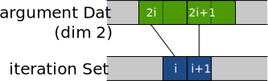
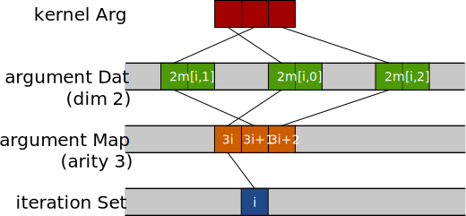
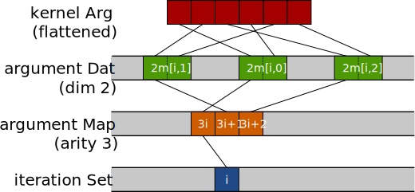
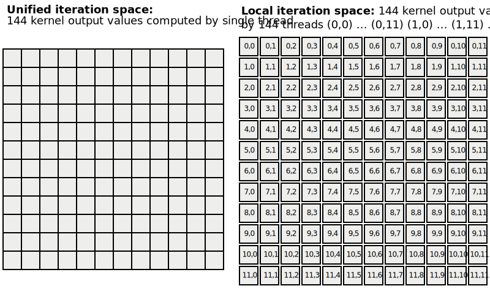

.. _kernels:

PyOP2 Kernels
=============

Kernels in PyOP2 define the local operations that are to be performed for each
element of the iteration set the kernel is executed over. There must be a one
to one match between the arguments declared in the kernel signature and the
actual arguments passed to the parallel loop executing this kernel. As
described in :doc:`concepts`, data is accessed directly on the iteration set
or via mappings passed in the :func:`~pyop2.par_loop` call.

The kernel only sees data corresponding to the current element of the
iteration set it is invoked for. Any data read by the kernel i.e. accessed as
:data:`~pyop2.READ`, :data:`~pyop2.RW` or :data:`~pyop2.INC` is automatically
gathered via the mapping relationship in the *staging in* phase and the kernel
is passed pointers to the staging memory. Similarly, after the kernel has been
invoked, any modified data i.e. accessed as :data:`~pyop2.WRITE`,
:data:`~pyop2.RW` or :data:`~pyop2.INC` is scattered back out via the
:class:`~pyop2.Map` in the *staging out* phase. It is only safe for a kernel
to manipulate data in the way declared via the access descriptor in the
parallel loop call. Any modifications to an argument accessed read-only would
not be written back since the staging out phase is skipped for this argument.
Similarly, the result of reading an argument declared as write-only is
undefined since the data has not been staged in.

.. _kernel-api:

Kernel API
----------

Consider a :func:`~pyop2.par_loop` computing the midpoint of a triangle given
the three vertex coordinates. Note that we make use of a covenience in the
PyOP2 syntax, which allow declaring an anonymous :class:`~pyop2.DataSet` of a
dimension greater one by using the ``**`` operator. We omit the actual data in
the declaration of the :class:`~pyop2.Map` ``cell2vertex`` and
:class:`~pyop2.Dat` ``coordinates``. ::

  vertices = op2.Set(num_vertices)
  cells = op2.Set(num_cells)

  cell2vertex = op2.Map(cells, vertices, 3, [...])

  coordinates = op2.Dat(vertices ** 2, [...], dtype=float)
  midpoints = op2.Dat(cells ** 2, dtype=float)

  op2.par_loop(midpoint, cells,
               midpoints(op2.WRITE),
               coordinates(op2.READ, cell2vertex))

Kernels are implemented in a restricted subset of C99 and are declared by
passing a *C code string* and the *kernel function name*, which must match the
name in the C kernel signature, to the :class:`~pyop2.Kernel` constructor: ::

  midpoint = op2.Kernel("""
  void midpoint(double p[2], double *coords[2]) {
    p[0] = (coords[0][0] + coords[1][0] + coords[2][0]) / 3.0;
    p[1] = (coords[0][1] + coords[1][1] + coords[2][1]) / 3.0;
  }""", "midpoint")

Since kernels cannot return any value, the return type is always ``void``. The
kernel argument ``p`` corresponds to the third :func:`~pyop2.par_loop`
argument ``midpoints`` and ``coords`` to the fourth argument ``coordinates``
respectively. Argument names need not agree, the matching is by position.

Data types of kernel arguments must match the type of data passed to the
parallel loop. The Python types :class:`float` and :class:`numpy.float64`
correspond to a C :class:`double`, :class:`numpy.float32` to a C
:class:`float`, :class:`int` or :class:`numpy.int64` to a C :class:`long` and
:class:`numpy.int32` to a C :class:`int`.

Direct :func:`~pyop2.par_loop` arguments such as ``midpoints`` are passed to
the kernel as a ``double *``, indirect arguments such as ``coordinates`` as a
``double **`` with the first indirection due to the map and the second
indirection due the data dimension. The kernel signature above uses arrays
with explicit sizes to draw attention to the fact that these are known. We
could have interchangibly used a kernel signature with plain pointers:

.. code-block:: c

  void midpoint(double * p, double ** coords)

Argument creation supports an optional flag ``flatten``, which is used
for kernels which expect data to be laid out by component: ::

  midpoint = op2.Kernel("""
  void midpoint(double p[2], double *coords[1]) {
    p[0] = (coords[0][0] + coords[1][0] + coords[2][0]) / 3.0;
    p[1] = (coords[3][0] + coords[4][0] + coords[5][0]) / 3.0;
  }""", "midpoint")

  op2.par_loop(midpoint, cells,
               midpoints(op2.WRITE),
               coordinates(op2.READ, cell2vertex, flatten=True))

.. _data-layout:

Data layout
-----------

Data for a :class:`~pyop2.Dat` declared on a :class:`~pyop2.Set` is
stored contiguously for all elements of the set. For each element,
this is a contiguous chunk of data of a shape given by the
:class:`~pyop2.DataSet` ``dim`` and the datatype of the
:class:`~pyop2.Dat`.  The size of this chunk is the product of the
extents of the ``dim`` tuple times the size of the datatype.

During execution of the :func:`~pyop2.par_loop`, the kernel is called
for each element of the iteration set and passed data for each of its
arguments corresponding to the current set element ``i`` only.

For a directly accessed argument such as ``midpoints`` above, the
kernel is passed a pointer to the beginning of the chunk of data for
the element ``i`` the kernel is currently called for. In CUDA/OpenCL
``i`` is the global thread id since the kernel is launched in parallel
for all elements.

  Data layout for a directly accessed :class:`~pyop2.Dat` argument with
  ``dim`` 2

For an indirectly accessed argument such as ``coordinates`` above,
PyOP2 gathers pointers to the data via the :class:`~pyop2.Map`
``cell2vertex`` used for the indirection. The kernel is passed a list
of pointers of length corresponding to the *arity* of the
:class:`~pyop2.Map`, in the example above 3. Each of these points to
the data chunk for the element in the target :class:`~pyop2.Set` given
by :class:`~pyop2.Map` entries ``(i, 0)``, ``(i, 1)`` and ``(i, 2)``.

  Data layout for a :class:`~pyop2.Dat` argument with ``dim`` 2 indirectly
  accessed through a :class:`~pyop2.Map` of ``arity`` 3

If the argument is created with the keyword argument ``flatten`` set
to ``True``, a flattened vector of pointers is passed to the kernel.
This vector is of length ``dim * arity`` (where ``dim`` is the product
of the extents of the ``dim`` tuple), which is 6 in the example above.
Each entry points to a single data value of the :class:`~pyop2.Dat`.
The ordering is by component of ``dim`` i.e. the first component of
each data item for each element in the target set pointed to by the
map followed by the second component etc.

  Data layout for a flattened :class:`~pyop2.Dat` argument with ``dim`` 2
  indirectly accessed through a :class:`~pyop2.Map` of ``arity`` 3

.. _local-iteration-spaces:

Local iteration spaces
----------------------

PyOP2 supports complex kernels with large local working set sizes, which may
not run very efficiently on architectures with a limited amount of registers
and on-chip resources. In many cases the resource usage is proportional to the
size of the *local iteration space* the kernel operates on.

Consider a finite-element local assembly kernel for vector-valued basis
functions of second order on triangles.  There are kernels more complex and
computing considerably larger local tensors commonly found in finite-element
computations, in particular for higher-order basis functions, and this kernel
only serves to illustrate the concept. For each element in the iteration set,
this kernel computes a 12x12 local tensor:

.. code-block:: c

  void kernel(double A[12][12], ...) {
    ...
    // loops over the local iteration space
    for (int j = 0; j < 12; j++) {
      for (int k = 0; k < 12; k++) {
        A[j][k] += ...
      }
    }
  }

PyOP2 invokes this kernel for each element in the iteration set:

.. code-block:: c

  for (int ele = 0; ele < nele; ++ele) {
    double A[12][12];
    ...
    kernel(A, ...);
  }

To improve the efficiency of executing complex kernels on manycore
platforms, their operation can be distributed among several threads
which each compute a single point in this local iteration space to
increase the level of parallelism and to lower the amount of resources
required per thread. In the case of the kernel above we obtain:

.. code-block:: c

  void mass(double A[1][1], ..., int j, int k) {
    ...
    A[0][0] += ...
  }

Note how the doubly nested loop over basis function is hoisted out of the
kernel, which receives its position in the local iteration space to compute as
additional arguments ``j`` and ``k``. PyOP2 then calls the kernel for
each element of the local iteration space for each set element:

.. code-block:: c

  for (int ele = 0; ele < nele; ++ele) {
    double A[1][1];
    ...
    for (int j = 0; j < 12; j++) {
      for (int k = 0; k < 12; k++) {
        kernel(A, ..., j, k);
      }
    }
  }

On manycore platforms, the local iteration space does not translate into a
loop nest, but rather into a larger number of threads being launched to
compute each of its elements:

  Local iteration space for a kernel computing a 12x12 local tensor

PyOP2 needs to be told to loop over this local iteration space by
indexing the corresponding maps with an
:class:`~pyop2.base.IterationIndex` :data:`~pyop2.i` in the
:func:`~pyop2.par_loop` call.
