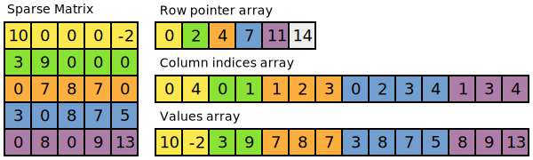
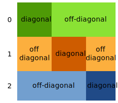

.. _linear_algebra:

PyOP2 Linear Algebra Interface
==============================

PyOP2 supports linear algebra operations on sparse matrices using a thin
wrapper around the PETSc_ library harnessed via its petsc4py_ interface.

As described in :doc:`concepts`, a sparse matrix is a linear operator that
maps a :class:`~pyop2.DataSet` representing its row space to a
:class:`~pyop2.DataSet` representing its column space and vice versa. These
two spaces are commonly the same, in which case the resulting matrix is
square. A sparse matrix is represented by a :class:`~pyop2.Mat`, which is
declared on a :class:`~pyop2.Sparsity`, representing its non-zero structure.

.. _matrix_storage:

Sparse Matrix Storage Formats
-----------------------------

PETSc_ uses the popular Compressed Sparse Row (CSR) format to only store the
non-zero entries of a sparse matrix. In CSR, a matrix is stored as three
one-dimensional arrays of *row pointers*, *column indices* and *values*, where
the two former are of integer type and the latter of float type, usually
double. As the name suggests, non-zero entries are stored per row, where each
non-zero is defined by a pair of column index and corresponding value. The
column indices and values arrays therefore have a length equal to the total
number of non-zero entries. Row indices are given implicitly by the row
pointer array, which contains the starting index in the column index and
values arrays for the non-zero entries of each row. In other words, the
non-zeros for row ``i`` are at positions ``row_ptr[i]`` up to but not
including ``row_ptr[i+1]`` in the column index and values arrays. For each
row, entries are sorted by column index to allow for faster lookups using a
binary search.

  A sparse matrix and its corresponding CSR row pointer, column indices and
  values arrays

For distributed parallel storage with MPI, the rows of the matrix are
distribued evenly among the processors. Each row is then again divided into a
*diagonal* and an *off-diagonal* part, where the diagonal part comprises
columns ``i`` to ``j`` if ``i`` and ``j`` are the first and last row owned by
a given processor, and the off-diagonal part all other rows.

  Distribution of a sparse matrix among 3 MPI processes

.. _matrix_assembly:

Matrix assembly
---------------

Sparse matrices are assembled by adding up local contributions which are
mapped to global matrix entries via a local-to-global mapping represented by a
pair of :class:`Maps <pyop2.Map>` for the row and column space. 

.. figure:: images/assembly.svg
  :align: center

  Assembly of a local tensor :math:`A^K` into a global matrix :math:`A` using
  the local-to-global mapping :math:`\iota_K^1` for rows and :math:`\iota_K^2`
  for columns

For each :func:`~pyop2.par_loop` that assembles a matrix, PyOP2 generates a
call to PETSc_'s MatSetValues_ function for each element of the iteration set,
adding the local contributions computed by the user kernel to the global
matrix using the given :class:`Maps <pyop2.Map>`. At the end of the
:func:`~pyop2.par_loop` PyOP2 automatically calls MatAssemblyBegin_ and
MatAssemblyEnd_ to finalise matrix assembly.

Consider assembling a :class:`~pyop2.Mat` on a :class:`~pyop2.Sparsity` built
from a :class:`~pyop2.Map` from ``elements`` to ``nodes``. The assembly is
done in a :func:`~pyop2.par_loop` over ``elements``, where the
:class:`~pyop2.Mat` ``A`` is accssed indirectly via the ``elem_node``
:class:`~pyop2.Map` using the :class:`~pyop2.base.IterationIndex`
:class:`~pyop2.i`:

.. code-block:: python

  nodes = op2.Set(NUM_NODES, "nodes")
  elements = op2.Set(NUM_ELE, "elements")

  elem_node = op2.Map(elements, nodes, 3, ...)

  sparsity = op2.Sparsity((nodes, nodes), (elem_node, elem_node))
  A = op2.Mat(sparsity, np.float64)

  b = op2.Dat(nodes, dtype=np.float64)

  # Assemble the matrix mat
  op2.par_loop(mat_kernel, elements,
               A(op2.INC, (elem_node[op2.i[0]], elem_node[op2.i[1]])),
               ...)

  # Assemble the right-hand side vector b
  op2.par_loop(rhs_kernel, elements,
               b(op2.INC, elem_node[op2.i[0]]),
               ...)

The code generated for the :func:`~pyop2.par_loop` assembling the
:class:`~pyop2.Mat` for the sequential backend is similar to the following,
where initialisation and staging code described in :ref:`sequential_backend`
have been omitted for brevity. For each element of the iteration
:class:`~pyop2.Set` a buffer for the local tensor is initialised to zero and
passed to the user kernel performing the local assembly operation. The
``addto_vector`` call subsequently adds this local contribution to the global
sparse matrix.

.. code-block:: c

  void wrap_mat_kernel__(...) {
    ...
    for ( int n = start; n < end; n++ ) {
      int i = n;
      ...
      double buffer_arg0_0[3][3] = {{0}};     // local tensor initialised to 0
      mat_kernel(buffer_arg0_0, ...);         // local assembly kernel
      addto_vector(arg0_0_0, buffer_arg0_0,   // Mat objet, local tensor
                   3, arg0_0_map0_0 + i * 3,  // # rows, global row indices
                   3, arg0_0_map1_0 + i * 3,  // # cols, global column indices
                   0);                        // mode: 0 add, 1 insert
    }
  }

.. _sparsity_pattern:

Building a sparsity pattern
---------------------------

The sparsity pattern of a matrix is uniquely defined by the dimensions of the
:class:`DataSets <pyop2.DataSet>` forming its row and column space, and one or
more pairs of :class:`Maps <pyop2.Map>` defining its non-zero structure. This
is exploited in PyOP2 by caching sparsity patterns with these unique
attributes as the cache key to save expensive recomputation. Whenever a
:class:`Sparsity` is initialised, an already computed pattern with the same
unique key is returned if it exists.

For a valid sparsity, each row :class:`~pyop2.Map` must map to the set of the
row :class:`~pyop2.DataSet`, each column :class:`~pyop2.Map` to that of the
column :class:`~pyop2.DataSet` and the from sets of each pair must match. A
matrix on a sparsity pattern built from more than one pair of maps is
assembled by multiple parallel loops iterating over the corresponding
iteration set for each pair.

Sparsity construction proceeds by iterating each :class:`~pyop2.Map` pair and
building a set of indices of the non-zero columns for each row. Each pair of
entries in the row and column maps gives the row and column index of a
non-zero entry in the matrix and therefore the column index is added to the
set of non-zero entries for that particular row. The array of non-zero entries
per row is then determined as the size of the set for each row and its
exclusive scan yields the row pointer array. The column index array is the
concatenation of all the sets. An algorithm for the sequential case is given
below: ::

  for rowmap, colmap in maps:
      for e in range(rowmap.from_size):
          for i in range(rowmap.arity):
              row = rowmap.values[i + e*rowmap.arity]
              for d in range(colmap.arity):
                  diag[row].insert(colmap.values[d + e * colmap.arity])

For the MPI parallel case a minor modification is required, since for each row
a set of diagonal and off-diagonal column indices needs to be built as
described in :ref:`matrix_storage`: ::

  for rowmap, colmap in maps:
      for e in range(rowmap.from_size):
          for i in range(rowmap.arity):
              row = rowmap.values[i + e*rowmap.arity]
              if row < nrows:
                  for d in range(colmap.arity):
                      if col < ncols:
                          diag[row].insert(colmap.values[d + e*colmap.arity])
                      else:
                          odiag[row].insert(colmap.values[d + e*colmap.arity])

.. _solving:

Solving a linear system
-----------------------

PyOP2 provides a :class:`~pyop2.Solver`, wrapping the PETSc_ KSP_ Krylov
solvers which support various iterative methods such as Conjugate Gradients
(CG), Generalized Minimal Residual (GMRES), a stabilized version of
BiConjugate Gradient Squared (BiCGStab) and others. The solvers are
complemented with a range of preconditioners from PETSc_'s PC_ collection,
which includes Jacobi, incomplete Cholesky and LU decompositions and various
multigrid based preconditioners.

The choice of solver and preconditioner type and other parameters uses
PETSc_'s configuration mechanism documented in the `PETSc manual`_. Options
are pased to the :class:`~pyop2.Solver` via the keyword argument
``parameters`` taking a dictionary of arguments or directly via keyword
arguments. The solver type is chosen as ``ksp_type``, the preconditioner as
``pc_type`` with the defaults ``cg`` and ``jacobi``.

Solving a linear system of the matrix ``A`` assembled above and the right-hand
side vector ``b`` for a solution vector ``x`` is done with a call to
:meth:`~pyop2.Solver.solve`, where solver and preconditioner are chosen as
``gmres`` and ``ilu``: ::

  x = op2.Dat(nodes, dtype=np.float64)

  solver = op2.Solver(ksp_type='gmres', pc_type='ilu')
  solver.solve(A, x, b)

.. _gpu_assembly:

GPU matrix assembly
-------------------

In a :func:`~pyop2.par_loop` assembling a :class:`~pyop2.Mat` on the GPU, the
local contributions are first computed for all elements of the iteration set
and stored in global memory in a structure-of-arrays (SoA) data layout such
that all threads can write the data out in a coalesced manner. For the example
above, the generated CUDA wrapper code is as follows, again omitting
initialisation and staging code described in :ref:`cuda_backend`.  The user
kernel only computes a single element in the local iteration space as detailed
in :ref:`local-iteration-spaces`.

.. code-block:: c

  __global__ void __mat_kernel_stub(...,
                                    double *arg0,    // local matrix data array
                                    int arg0_offset, // offset into the array
                                    ... ) {
    ... // omitted initialisation and shared memory staging code
    for ( int idx = threadIdx.x; idx < nelem; idx += blockDim.x ) {
      ... // omitted staging code
      for ( int i0 = 0; i0 < 3; ++i0 ) {
        for ( int i1 = 0; i1 < 3; ++i1 ) {
          mass_cell_integral_0_otherwise(
            (double (*)[1])(arg0 + arg0_offset + idx * 9 + i0 * 3 + i1 * 1),
            ..., i0, i1);
        }
      }
    }
  }

A separate CUDA kernel given below is launched afterwards to compress the data
into a sparse matrix in CSR storage format. Only the values array needs to be
computed, since the row pointer and column indices have already been computed
when building the sparsity on the host and subsequently transferred to GPU
memory. Memory for the local contributions and the values array only needs to
be allocated on the GPU.

.. code-block:: c

  __global__ void __lma_to_csr(double *lmadata,  // local matrix data array
                               double *csrdata,  // CSR values array
                               int *rowptr,      // CSR row pointer array
                               int *colidx,      // CSR column indices array
                               int *rowmap,      // row map array
                               int rowmapdim,    // row map arity
                               int *colmap,      // column map array
                               int colmapdim,    // column map arity
                               int nelems) {
    int nentries_per_ele = rowmapdim * colmapdim;
    int n = threadIdx.x + blockIdx.x * blockDim.x;
    if ( n >= nelems * nentries_per_ele ) return;

    int e = n / nentries_per_ele;                        // set element
    int i = (n - e * nentries_per_ele) / rowmapdim;      // local row
    int j = (n - e * nentries_per_ele - i * colmapdim);  // local column

    // Compute position in values array
    int offset = pos(rowmap[e * rowmapdim + i], colmap[e * colmapdim + j],
                     rowptr, colidx);
    __atomic_add(csrdata + offset, lmadata[n]);
  }

.. _gpu_solve:

GPU linear algebra
------------------

Linear algebra on the GPU with the ``cuda`` backend uses the Cusp_ library,
which does not support all solvers and preconditioners provided by PETSc_. The
interface to the user is the same as for the ``sequential`` and ``openmp``
backends. Supported solver types are CG (``cg``), GMRES (``gmres``) and
BiCGStab (``bicgstab``), with preconditioners of types Jacobi (``jacobi``),
Bridson approximate inverse (``ainv``) and asymptotic multigrid (``amg``). An
exception is raised if an unsupported solver or preconditioner type is
requested.  A Cusp_ solver with the chosen parameters is automatically
generated when :func:`~pyop2.solve` is called.

.. note ::
  Distributed parallel linear algebra operations with MPI are currently not
  supported by the ``cuda`` backend.

.. _PETSc: http://www.mcs.anl.gov/petsc/
.. _petsc4py: http://pythonhosted.org/petsc4py/
.. _MatSetValues: http://www.mcs.anl.gov/petsc/petsc-dev/docs/manualpages/Mat/MatSetValues.html
.. _MatAssemblyBegin: http://www.mcs.anl.gov/petsc/petsc-dev/docs/manualpages/Mat/MatAssemblyBegin.html
.. _MatAssemblyEnd: http://www.mcs.anl.gov/petsc/petsc-dev/docs/manualpages/Mat/MatAssemblyEnd.html
.. _KSP: http://www.mcs.anl.gov/petsc/petsc-dev/docs/manualpages/KSP/
.. _PC: http://www.mcs.anl.gov/petsc/petsc-dev/docs/manualpages/PC/
.. _PETSc manual: http://www.mcs.anl.gov/petsc/petsc-dev/docs/manual.pdf
.. _Cusp: http://cusplibrary.github.io
