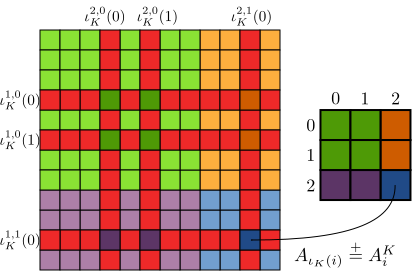

.. _mixed:

Mixed Types
===========

When solving linear systems of equations as they arise for instance in the
finite-element method (FEM), one is often interested in *coupled* solutions of
more than one quantity. In fluid dynamics, a common example is solving a
coupled system of velocity and pressure as it occurs in some formulations of
the Navier-Stokes equations.

Mixed Set, DataSet, Map and Dat
-------------------------------

PyOP2 provides the mixed types :class:`~pyop2.MixedSet`
:class:`~pyop2.MixedDataSet`, :class:`~pyop2.MixedMap` and
:class:`~pyop2.MixedDat` for a :class:`~pyop2.Set`, :class:`~pyop2.DataSet`,
:class:`~pyop2.Map` and :class:`~pyop2.Dat` respectively. A mixed type is
constructed from a list or other iterable of its base type and provides the
same attributes and methods. Under most circumstances types and mixed types
behave the same way and can be treated uniformly. Mixed types allow iteration
over their constituent parts and for convenience the base types are also
iterable, yielding themselves.

A :class:`~pyop2.MixedSet` is defined from a list of sets: ::

  s1, s2 = op2.Set(N), op2.Set(M)
  ms = op2.MixedSet([s1, s2])

There are a number of equivalent ways of defining a
:class:`~pyop2.MixedDataSet`: ::

  mds = op2.MixedDataSet([s1, s2], (1, 2))
  mds = op2.MixedDataSet([s1**1, s2**2])
  mds = op2.MixedDataSet(ms, (1, 2))
  mds = ms**(1, 2)

A :class:`~pyop2.MixedDat` with no associated data is defined in one of the
following ways: ::

  md = op2.MixedDat(mds)
  md = op2.MixedDat([s1**1, s2**2])
  md = op2.MixedDat([op2.Dat(s1**1), op2.Dat(s2**2)])

Finally, a :class:`~pyop2.MixedMap` is defined from a list of maps, all of
which must share the same source :class:`~pyop2.Set`: ::

  it = op2.Set(S)
  mm = op2.MixedMap([op2.Map(it, s1, 2), op2.Map(it, s2, 3)])

Block Sparsity and Mat
----------------------

When declaring a :class:`~pyop2.Sparsity` on pairs of mixed maps, the
resulting sparsity pattern has a square block structure with as many block
rows and columns as there are components in the :class:`~pyop2.MixedDataSet`
forming its row and column space. In the most general case a
:class:`~pyop2.Sparsity` is constructed as follows: ::

  it = op2.Set(...)  # Iteration set
  sr0, sr1 = op2.Set(...), op2.Set(...)  # Sets for row spaces
  sc0, sc1 = op2.Set(...), op2.Set(...)  # Sets for column spaces
  # MixedMaps for the row and column spaces
  mr = op2.MixedMap([op2.Map(it, sr0, ...), op2.Map(it, sr1, ...)])
  mc = op2.MixedMap([op2.Map(it, sc0, ...), op2.Map(it, sc1, ...)])
  # MixedDataSets for the row and column spaces
  dsr = op2.MixedDataSet([sr0**1, sr1**1])
  dsc = op2.MixedDataSet([sc0**1, sc1**1])
  # Blocked sparsity
  sparsity = op2.Sparsity((dsr, dsc), [(mr, mc), ...])

The relationships of each component of the mixed maps and datasets to the
blocks of the :class:`~pyop2.Sparsity` is shown in the following diagram:

.. figure:: images/mixed_sparsity.svg
  :align: center

  The contribution of sets, maps and datasets to the blocked sparsity. 

Block sparsity patterns are computed separately for each block as described in
:ref:`sparsity_pattern` and the same validity rules apply. A
:class:`~pyop2.Mat` defined on a block :class:`~pyop2.Sparsity` has the same
block structure, which is implemented using a PETSc_ MATNEST_.

Mixed Assembly
--------------

When assembling into a :class:`~pyop2.MixedDat` or a block
:class:`~pyop2.Mat`, the :class:`~pyop2.Kernel` produces a local tensor of the
same block structure, which is a combination of :ref:`local-iteration-spaces`
of all its subblocks. This is entirely transparent to the kernel however,
which sees the combined local iteration space.  PyOP2 ensures that indirectly
accessed data is gathered and scattered via the correct maps and packed
together into a contiguous vector to be passed to the kernel. Contributions
from the local tensor are assembled into the correct blocks of the
:class:`~pyop2.MixedDat` or :class:`~pyop2.Mat`.

Consider the following example :func:`~pyop2.par_loop` assembling a block
:class:`~pyop2.Mat`:

.. code-block:: python

  it, cells, nodes = op2.Set(...), op2.Set(...), op2.Set(...)
  mds = op2.MixedDataSet([nodes, cells])
  mmap = op2.MixedMap([op2.Map(it, nodes, 2, ...), op2.Map(it, cells, 1, ...)])
  mat = op2.Mat(op2.Sparsity(mds, mmap))
  d = op2.MixedDat(mds)

  op2.par_loop(kernel, it,
               mat(op2.INC, (mmap[op2.i[0]], mmap[op2.i[1]])),
               d(op2.read, mmap))

The ``kernel`` for this :func:`~pyop2.par_loop` assembles a 3x3 local tensor
and is passed an input vector of length 3 for each iteration set element:

.. code-block:: c

  void kernel(double v[3][3] , double **d ) {
    for (int i = 0; i<3; i++)
      for (int j = 0; j<3; j++)
        v[i][j] += d[i][0] * d[j][0];
  }

The top-left 2x2 block of the local tensor is assembled into the (0,0) block
of the matrix, the top-right 2x1 block into (0,1), the bottom-left 1x2 block
into (1,0) and finally the bottom-right 1x1 block into (1,1). Note that for
the (0,0) block only the first component of the :class:`~pyop2.MixedDat` is
read and for the (1,1) block only the second component. For the (0,1) and
(1,0) blocks, both components of the :class:`~pyop2.MixedDat` are accessed.

This diagram illustrates the assembly of the block :class:`~pyop2.Mat`:

  Assembling into the blocks of a global matrix :math:`A`: block
  :math:`A^{0,0}` uses maps :math:`\iota^{1,0}` and :math:`\iota^{2,0}`,
  :math:`A^{0,1}` uses :math:`\iota^{1,0}` and :math:`\iota^{2,1}`,
  :math:`A^{1,0}` uses :math:`\iota^{1,1}` and :math:`\iota^{2,0}` and finally
  :math:`A^{1,1}` uses :math:`\iota^{1,1}` and :math:`\iota^{2,1}` for the row
  and column spaces respectively.

.. _PETSc: http://www.mcs.anl.gov/petsc/
.. _MATNEST: http://www.mcs.anl.gov/petsc/petsc-current/docs/manualpages/Mat/MATNEST.html
