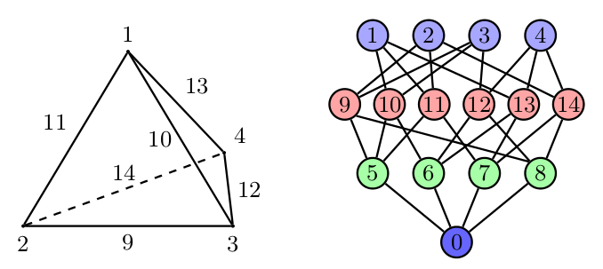

.. only:: html

   .. contents::

=================================
 Interfacing directly with PETSc
=================================

Introduction
============

Sometimes, the system we wish to solve can not be described purely in
terms of a sum of weak forms that we can then assemble.  Or else, it
might be, but the resulting assembled operator would be dense.  In
this chapter, we will see how to solve such problems in a
"matrix-free" manner, using Firedrake to assemble the pieces and then
providing a matrix object to PETSc which is unassembled.  Note that
this is a lower-level interface than that described in
:doc:`matrix-free`, so you should try that first to see if it suits
your needs.

To take a concrete example, let us consider a linear system obtained
from a normal variational problem, augmented with a rank-1
perturbation:

.. math::

   B := A + \vec{u} \vec{v}^T.

Such operators appear, for example, in limited memory quasi-Newton
methods such as L-BFGS or Broyden.

The matrix :math:`B` is dense, however its action on a vector may be
computed in only marginally more work than computing the action of
:math:`A` since

.. math::

   B \vec{x} \equiv A \vec{x} + \vec{u} (\vec{v} \cdot \vec{x}).

Accessing PETSc objects
=======================

Firedrake builds on top of PETSc for its linear algebra, and therefore
all assembled forms provide access to the underlying PETSc object.
For assembled bilinear forms, the PETSc object is a ``Mat``; for
assembled linear forms, it is a ``Vec``.  The ways we access these are
different.  For a bilinear form, the matrix is obtained with:

.. code-block:: python3

   petsc_mat = assemble(bilinear_form).M.handle

For a linear form, we need to use a context manager.  There are two
options available here, depending on whether we want read-only or
read-write access to the PETSc object.  For read-only access, we use:

.. code-block:: python3

   with assemble(linear_form).dat.vec_ro as v:
       petsc_vec_ro = v

For write-only access, use ``.vec_wo``, and for read-write access, use:

.. code-block:: python3

   with assemble(linear_form).dat.vec as v:
       petsc_vec = v

These context managers ensure that if PETSc writes to the vector,
Firedrake sees the modification of the values.

Plotting the sparsity of a PETSc ``Mat``
----------------------------------------

Given a PETSc matrix of type ``'seqaij'``, we may access
its compressed sparse row format and convert to that used in
SciPy in the following way:

.. code-block:: python3

    import scipy.sparse as sp

    indptr, indices, data = petsc_mat.getValuesCSR()
    scipy_mat = sp.csr_matrix((data, indices, indptr), shape=petsc_mat.getSize())

The sparsity pattern may then be straightforwardly plotted
using matplotlib:

.. code-block:: python3

    import matplotlib.pyplot as plt

    plt.spy(scipy_mat)

Building an operator
====================

To solve the linear system :math:`Bx = b` we need to define the
operator :math:`B` such that PETSc can use it.  To do this, we build a
Python class that provides a ``mult`` method:

.. code-block:: python3

   class MatrixFreeB(object):

       def __init__(self, A, u, v):
           self.A = A
           self.u = u
           self.v = v

       def mult(self, mat, x, y):
           # y <- A x
           self.A.mult(x, y)

           # alpha <- v^T x
           alpha = self.v.dot(x)

           # y <- y + alpha*u
           y.axpy(alpha, self.u)

Now we must build a PETSc ``Mat`` and indicate that it should use this
newly defined class to compute the matrix action:

.. code-block:: python3

   # Import petsc4py namespace
   from firedrake.petsc import PETSc

   B = PETSc.Mat().create()

   # Assemble the bilinear form that defines A and get the concrete
   # PETSc matrix
   A = assemble(bilinear_form).M.handle

   # Now do the same for the linear forms for u and v, making a copy

   with assemble(u_form).dat.vec_ro as u_vec:
       u = u_vec.copy()

   with assemble(v_form).dat.vec_ro as v_vec:
       v = v_vec.copy()

   # Build the matrix "context"
   Bctx = MatrixFreeB(A, u, v)

   # Set up B
   # B is the same size as A
   B.setSizes(A.getSizes())

   B.setType(B.Type.PYTHON)
   B.setPythonContext(Bctx)
   B.setUp()

The next step is to build a linear solver object to solve the system.
For this we need a PETSc ``KSP``:

.. code-block:: python3

   ksp = PETSc.KSP().create()

   ksp.setOperators(B)

   ksp.setFromOptions()

Now we can solve a system using this ``ksp`` object:

.. code-block:: python3

   solution = Function(V)

   rhs = assemble(rhs_form)

   with rhs.dat.vec_ro as b:
       with solution.dat.vec as x:
           ksp.solve(b, x)

Defining a preconditioner
=========================

.. note::

   In many cases it is not necessary to drop to this low a level to
   construct problem-specific preconditioners. More details on this
   approach are discussed in the manual section on
   :doc:`preconditioning`.

Since PETSc only knows how to compute the action of :math:`B`, and
does not have access to any of the entries, it will not be able to
build a preconditioner for the linear solver.  To use a
preconditioner, we have to provide PETSc with one.  We can do this in
one of two ways.

1.

   Provide an assembled matrix to the ``KSP`` object to be used as a
   preconditioning matrix.  For example, we might use the matrix
   :math:`A`.  In this case, we merely have to call
   ``ksp.setOperators`` with two arguments:

   .. code-block:: python3

      ksp.setOperators(B, A)

   Now we solve the system :math:`Bx = b`, using :math:`A` to build a
   preconditioner.

2.

   Provide our own ``PC`` object to be used as the preconditioner.
   This is somewhat more involved.  As we did to define the
   matrix-free action of :math:`B`, we need to build an object that
   applies the action of our chosen preconditioner.  If we know that
   our matrix :math:`B` has some special structure, this can be more
   efficient than the previous method.

Providing a custom preconditioner
---------------------------------

Recall that we do not explicitly form :math:`B` since it is dense,
and subsequently its inverse is as well.  However, since we know that
:math:`B` is formed of a full-rank invertible matrix, :math:`A`, plus a
rank-1 update, it is possible to compute its inverse reasonably
cheaply using the `Sherman-Morrison formula`_.  Let :math:`A` be
invertible and :math:`u` and :math:`v` be column vectors such that
:math:`1 + v^T A^{-1} u \neq 0` then:

.. math::

   B^{-1} = (A + u v^T)^{-1} = A^{-1} -
       \frac{A^{-1}u v^T A^{-1}}{1 + v^T A^{-1} u}.

Hence, we see that we can apply the action of :math:`B^{-1}` on a
vector using only the action of :math:`A^{-1}` and some dot products.

With these mathematical preliminaries out of the way, let us move on to
the implementation.  We need to define an object which has an
``apply`` method which applies the action of our preconditioner to a
vector.  The PETSc ``PC`` object will be created with access to the
operators we have provided to our solver, so for this class, we won't
pass :math:`A`, :math:`u` and :math:`v` explicitly, but rather extract
them from the operators in a ``setUp`` method:

.. code-block:: python3

   class MatrixFreePC(object):

       def setUp(self, pc):
           B, P = pc.getOperators()
           # extract the MatrixFreeB object from B
           ctx = B.getPythonContext()
           self.A = ctx.A
           self.u = ctx.u
           self.v = ctx.v
           # Here we build the PC object that uses the concrete,
           # assembled matrix A.  We will use this to apply the action
           # of A^{-1}
           self.pc = PETSc.PC().create()
           self.pc.setOptionsPrefix("mf_")
           self.pc.setOperators(self.A)
           self.pc.setFromOptions()
           # Since u and v do not change, we can build the denominator
           # and the action of A^{-1} on u only once, in the setup
           # phase.
           tmp = self.A.createVecLeft()
           self.pc.apply(self.u, tmp)
           self._Ainvu = tmp
           self._denom = 1 + self.v.dot(self._Ainvu)

       def apply(self, pc, x, y):
           # y <- A^{-1}x
           self.pc.apply(x, y)
           # alpha <- (v^T A^{-1} x) / (1 + v^T A^{-1} u)
           alpha = self.v.dot(y) / self._denom
           # y <- y - alpha * A^{-1}u
           y.axpy(-alpha, self._Ainvu)

Now we extract the ``PC`` object from the ``KSP`` linear solver and
indicate that it should use our matrix free preconditioner

.. code-block:: python3

    ksp = PETSc.KSP().create()
    ksp.setOperators(B)
    ksp.setUp()
    pc = ksp.pc
    pc.setType(pc.Type.PYTHON)
    pc.setPythonContext(MFPC())
    ksp.setFromOptions()

before going on to solve the system as before:

.. code-block:: python3

   solution = Function(V)

   rhs = assemble(rhs_form)

   with rhs.dat.vec_ro as b:
       with solution.dat.vec as x:
           ksp.solve(b, x)

Accessing the PETSc mesh representation
=======================================

Under the hood, Firedrake uses PETSc's DMPlex unstructured mesh
representation. It uses a hierarchical approach, where entities
of different dimension are put on different levels of the
hierarchy. The single tetrahedral element shown on the left below
may be interpreted using the graph representation on the right.
Entities of dimension zero (vertices) are shown at the top.
Entities of dimension one (edges) are shown on the next level down.
Entities of dimension two (faces) are shown on the penultimate
level and the (dimension three) element itself is on the bottom
level. Edges in the graph indicate which entities own/are owned
by others.

The DMPlex associated with a given ``mesh`` may be accessed via
its ``topology_dm`` attribute:

.. code-block:: python3

    plex = mesh.topology_dm

All entities in a DMPlex are given a unique number. The range
of these numbers may be deduced using the method
``plex.getDepthStratum``, whose only argument is the entity
dimension sought. For example, 0 for vertices, 1 for edges, etc.
Similarly, the method ``plex.getHeightStratum`` can be used for
codimension access. For example, height 0 corresponds to cells.
The hierarchical DMPlex structure may be traversed using other
methods, such as ``plex.getCone``, ``plex.getSupport`` and
``plex.getTransitiveClosure``. See the `Firedrake DMPlex paper`_
and the `PETSc manual`_ for details.

If vertex coordinate information is to be accessed from the
DMPlex then we must first establish a mapping between
`its numbering`_ and the coordinates in the Firedrake mesh. This is done
by establishing a 'section'. A section provides a way of associating
data with the mesh - in this case, coordinate field data.
For a $d$-dimensional mesh, we seek to establish offsets to recover
$d$-tuple coordinates for the degrees of freedom.

For a linear mesh, we seek $d$ values at each vertex and no values for
entities of higher dimension. In 2D, for example, this corresponds to the array

.. math::

   (d, 0, 0).

For an order $p$ Lagrange mesh, it is a little more complicated. In
the 2D triangular case, we require the following entities:

.. math::

   (d, d(p-1), d(p-1)(p-2)/2).

Accordingly, set

.. code-block:: python3

    dim = mesh.topological_dimension()
    gdim = mesh.geometrical_dimension()
    entity_dofs = np.zeros(dim+1, dtype=np.int32)
    entity_dofs[0] = gdim
    entity_dofs[1] = gdim*(p-1)
    entity_dofs[2] = gdim*((p-1)*(p-2))//2

We then use Firedrake's helper function for creating a PETSc
section to establish the mapping:

.. code-block:: python3

    from firedrake.cython.dmcommon import create_section

    coord_section = create_section(mesh, entity_dofs)
    plex = mesh.topology_dm
    plex_coords = plex.getCoordinateDM()
    plex_coords.setDefaultSection(coord_section)
    coords_local = plex_coords.createLocalVec()
    coords_local.array[:] = np.reshape(mesh.coordinates.dat.data_ro_with_halos, coords_local.array.shape)
    plex.setCoordinatesLocal(coords_local)

We can then extract coordinates for node ``i`` belonging to
entity ``d`` (according to the DMPlex numbering) by

.. code-block:: python3

    dofs = coord_section.getDof(d)
    offset = coord_section.getOffset(d)//dim + i
    coord = mesh.coordinates.dat.data_ro_with_halos[offset]
    print(f"Node {i} belonging to entity {d} has coordinates {coord}")

.. _Sherman-Morrison formula: https://en.wikipedia.org/wiki/Sherman%E2%80%93Morrison_formula
.. _Firedrake DMPlex paper: https://arxiv.org/abs/1506.07749
.. _PETSc manual: https://petsc.org/release/docs/manual/dmplex/
.. _its numbering: https://petsc.org/release/docs/manual/dmplex/#data-layout
