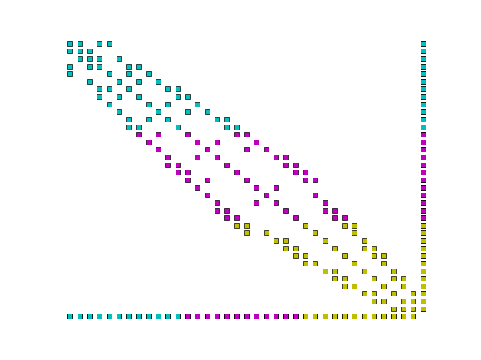

.. default-role:: math

The `R` space
=============

The function space `R` (for "Real") is the space of functions which
are constant over the whole domain. It is employed to model concepts
such as global constraints.

An example:
-----------

.. warning::

   This section illustrates the use of the Real space using the
   simplest example. This is usually not the optimal approach for
   removing the nullspace of an operator. If that is your only goal
   then you are probably better placed removing the null space in the
   linear solver using the facilities documented in the section
   :ref:`singular_systems`.

Consider a Poisson equation in weak form, find `u\in V` such that:

.. math::

  \int_\Omega \nabla u \cdot \nabla v \,\mathrm{d}x  = -\int_{\Gamma(3)} v\,\mathrm{d}s + \int_{\Gamma(4)} v\,\mathrm{d}s \qquad\forall v\in V

where `\Gamma(3)` and `\Gamma(4)` are domain boundaries over which the
boundary conditions `\nabla u \cdot n = -1` and `\nabla u \cdot n = 1`
are applied respectively. This system has a null space composed of the
constant functions. One way to remove this is to add a Lagrange
multiplier from the space `R` and use the resulting constraint
equation to enforce that the integral of `u` is zero. The resulting
system is find `u\in V`, `r\in R` such that:

.. math::

  \int_\Omega \nabla u \cdot \nabla v + rv\,\mathrm{d}x  = -\int_{\Gamma(3)} v\,\mathrm{d}s + \int_{\Gamma(4)} v\,\mathrm{d}s \qquad\forall v\in V

  \int_\Omega us \,\mathrm{d}x = 0 \qquad \forall s\in R

The corresponding Python code is:

.. code-block:: python3

  from firedrake import *

  m = UnitSquareMesh(25, 25)
  V = FunctionSpace(m, 'CG', 1)
  R = FunctionSpace(m, 'R', 0)
  W = V * R
  u, r = TrialFunctions(W)
  v, s = TestFunctions(W)

  a = inner(grad(u), grad(v))*dx + u*s*dx + v*r*dx
  L = -v*ds(3) + v*ds(4)

  w = Function(W)
  solve(a == L, w)
  u, s = split(w)
  exact = Function(V)
  x, y = SpatialCoordinate(m)
  exact.interpolate(y - 0.5)
  print sqrt(assemble((u - exact)*(u - exact)*dx))

Setting and retrieving the value of a function in `R`
-----------------------------------------------------

Functions in the space `R` are equivalent to a single floating point value. The
value can be set using the :meth:`assign` method of Firedrake functions, and
the value can be accessed simply by casting it to :func:`float`:

.. code-block:: python3

  from firedrake import *

  m = UnitSquareMesh(25, 25)
  R = FunctionSpace(m, 'R', 0)

  f = Function(V)
  f.assign(2.0)
  print(float(f))

.. note::

  The `R` space is not currently supported in complex mode.

Representing matrices involving `R`
-----------------------------------

Functions in the space `R` are different from other finite element
functions in that their support extends to the whole domain. To
illustrate the consequences of this, we can represent the matrix in
the Poisson problem above as:

.. math::

  A= \begin{bmatrix} L & K \\
  K^T & 0
  \end{bmatrix}

where:

.. math::

  L_{ij} = \int_\Omega \nabla \phi_i \phi_j \,\mathrm{d}x

  K_{ij} = \int_\Omega \phi_i \psi_j \,\mathrm{d}x

where `\{\phi_i\}` is the basis for `V` and `\{\psi_i\}` is the basis
for `R`. Note that there is only a single basis function for `R` and `\psi_i \equiv 1` hence:

.. math::

  K_{ij} = \int_\Omega \phi_i \,\mathrm{d}x

with the result that `K` is a single dense matrix column. Similiarly,
`K^T` is a single dense matrix row.

Using the CSR matrix format typically employed by Firedrake, each
matrix row is stored on a single processor. Were this carried through to `K^T`, both the assembly and
action of this row would require the entire system state to be gathered
onto one MPI process. This is clearly a horribly non-performant
option.

Instead, we observe that a dense matrix row (or column) is isomorphic
to a :class:`~firedrake.function.Function` and implement these matrix
blocks accordingly.

   Example parallel distribution of the matrix `A`. Colours indicate
   the processor on which the data is stored. Notice the dense row and
   column, and that the dense row is distributed across the
   processors.

Assembling matrices involving `R`
---------------------------------

Assembling the column block is implemented by replacing the trial
function with the constant 1, thereby transforming a 2-form into a
1-form, and assembling. Similarly, assembling the row block simply
requires the replacement of the test function with the constant 1, and
assembling.

The one by one block in the corner is assembled by replacing both
the test and trial functions of the corresponding form with 1 and
assembling. The remaining block does not involve `R` and is assembled
as usual.

Using `R` space with extruded meshes
------------------------------------

On extruded meshes it is possible to construct tensor product function spaces
with the `R` space. Using the `R` space in the extruded direction provides a
convenient way of expressing fields that are constant along the extrusion.

The example below illustrates how the `R` space can be used to compute a
vertical average of a three-dimensional DG1 field by projecting the source
field on a DG1 x R space.

.. code-block:: python3

  from firedrake import *

  mesh2d = UnitSquareMesh(10, 10)
  mesh = ExtrudedMesh(mesh2d, 10, 0.1)

  V = FunctionSpace(mesh, 'DG', 1, vfamily='DG', vdegree=1)
  f = Function(V)
  x, y, z = SpatialCoordinate(mesh)
  f.interpolate(sin(2*pi*z))

  U = FunctionSpace(mesh, 'DG', 1, vfamily='R', vdegree=0)
  g = Function(U, name='g')
  g.project(f)

  print('f min: {:.3g}, max: {:.3g} '.format(f.dat.data.min(), f.dat.data.max()))
  print('g min: {:.3g}, max: {:.3g} '.format(g.dat.data.min(), g.dat.data.max()))
