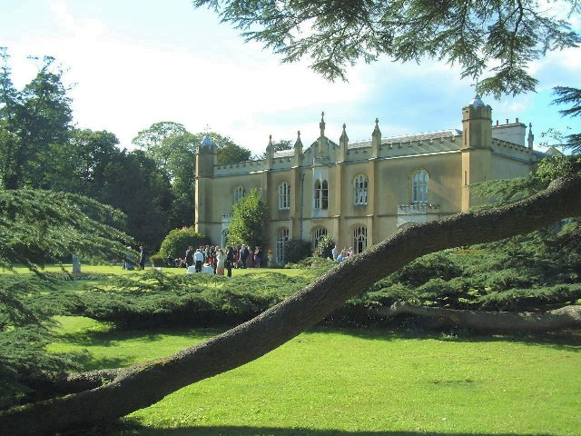

:orphan: true

.. title:: SysGenX meeting and sprint

SysGenX Meeting and Sprint
--------------------------
               
The whole SysGenX consortium and collaborators will be be meeting at `Missenden
Abbey <https://missendenabbey.co.uk>`__ from 11-13 September 2023. This is a
key opportunity to exchange results and ideas related to the SysGenX project,
and to sit down together and collaborate on code and simulations.

The meeting will run from 1200 on 11 September until 1100 on 13 September. For
those interested, the :doc:`Firedrake '23 <firedrake_23>` meeting will run for the rest of the week
in the same location.

Registration
------------

Registration has now closed.

Further details
---------------

For any queries, please contact `David Ham <mailto:david.ham@imperial.ac.uk>`_.
